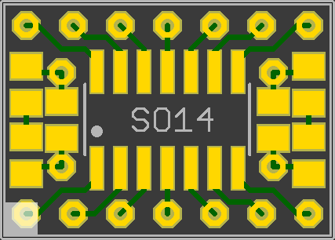
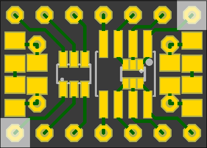
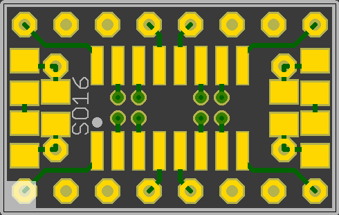
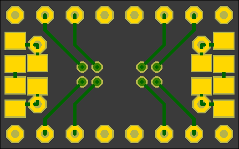
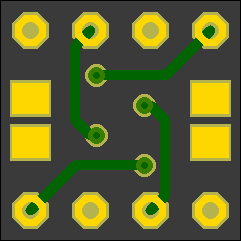
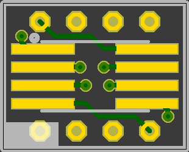
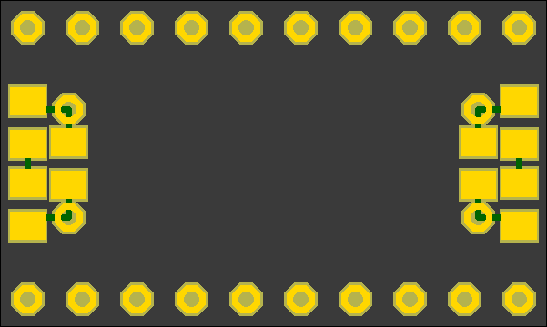
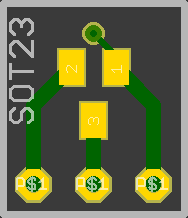
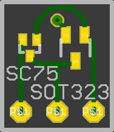
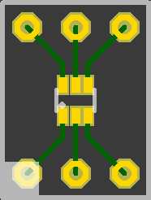

smbb
====

Various surface mount to breadboard adapters.

The preview rendering doesn't show all details correctly (eg left out solder mask on bare copper).

Where possible, there are additiobal pads for bypass caps and/or led+resistor.

Boards
======

### [MSOP8_TSSOP8](MSOP8_TSSOP8.brd) 

 | 
-----------|------------
MSOP8 or TSSOP8 | —

### [SO14_SO8_SOT363_SOT23-6](SO14_SO8_SOT363_SOT23-6.brd)

 | 
-----------|------------
SO14 | SO8 or SOT363, SOT23-6

### [SO16](SO16.brd)

 | 
-----------|------------
SO16 | —

### [SO28](SO28.brd)

 | 
-----------|------------
SO28 | —

### [SO8](SO8.brd)

 | 
-----------|------------
SO8 | —

### [SO8_SO8W](SO8_SO8W.brd)

 | 
-----------|------------
SO8 or SO8W | bypass cap

### [SOP20](SOP20.brd)

 | 
-----------|------------
SOP20 | —

### [SOT223_UNIVERS4](SOT323_UNIVERS4.brd)

 | 
-----------|------------
SOT223 | 4 pads for various packages, PLCC4 works fine

### [SOT23-6_2xSOT23](SOT23-6_2xSOT23.brd)

 | 
-----------|------------
SOT23-6 | 2xSOT23

### [SOT23_SOT323_SC75](SOT23_SOT323_SC75.brd)

 | 
-----------|------------
SOT23 | SOT323 or SC75

### [SOT363_2xSOT23](SOT363_2xSOT23.brd)

 | 
-----------|------------
SOT363 | 2xSOT23

### [TO252_SOT89](TO252_SOT89.brd)

 | 
-----------|------------
TO252 | SOT89

### [TQFO44-0mm8](TQFO44-0mm8.brd)

 | 
-----------|------------
TQFP44 or smaller, 0.8mm | power plane, pullup/down, caps

### [TQFP64-0mm8](TQFP64-0mm8.brd)

 | 
-----------|------------
TQFP64 or smaller, 0.8mm | power plane, pullup/down, caps

### [UNIVERS2plus1](UNIVERS2plus1.brd)

 | 
-----------|------------
two connected and one floating pad, for smd cap/resistor/led and resistor/… | like front

EEVBlog Review
--------------

License
-------

 This work is licensed under a <a rel="license" href="http://creativecommons.org/licenses/by-sa/4.0/">Creative Commons Attribution-ShareAlike 4.0 International License</a>.
